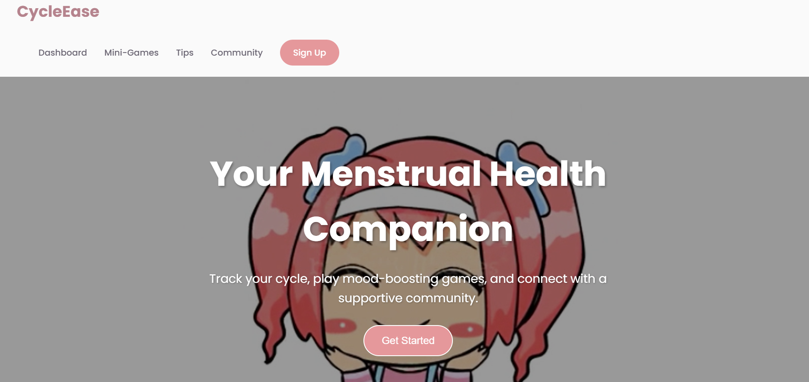

# CycleEase 🎯

## Basic Details
### Team Name: THINKER

### Team Members
- Member 1: NEHA PAULSON - SAHRDAYA COLLEGE OF ENGINEERING AND TECHNOLOGY
- Member 2: NEHA JOHNSON - SAHRDAYA COLLEGE OF ENGINEERING AND TECHNOLOGY
- Member 3: JOICE C JOMON -SAHRDAYA COLLEGE OF ENGINEERING AND TECHNOLOGY

### Hosted Project Link
[mention your project hosted project link here]

### Project Description
CycleEase is a supportive platform designed to help women manage period discomfort with ease. It provides essential self-care tips for cramps and PMS, including hydration, exercise, heat therapy, and nutrition advice. The website also features mini-games to help relax the mind and reduce stress. By combining wellness guidance with interactive elements, Cyclease aims to make periods more comfortable and manageable

### The Problem statement
Many women experience cramps, PMS, and stress during menstruation but struggle to find simple, effective self-care solutions. CycleEase addresses this by providing essential tips on hydration, exercise, heat therapy, and nutrition, along with mini-games to help relax the mind. This platform offers a holistic approach to easing period discomfort and improving overall well-being.

### The Solution
We built Cyclease using HTML for structure, CSS for style, and JavaScript for interactivity. Together, they created a fun, engaging platform to help women manage period discomfort with tips, relaxation, and mini-games—all in one neat package!

## Technical Details
### Technologies/Components Used
For Software:
- [HTML,JAVASCRIPT,CSS]
- [VSCODE]
- [CURSOR]

### Implementation
For Software:
# Installation
[commands]

# Run
[commands]

### Project Documentation
For Software:

# Screenshots

*HOME PAGE*

*Add caption explaining what this shows*

*Add caption explaining what this shows*

# Diagrams

*Add caption explaining your workflow*

# Build Photos

*List out all components shown*

*Explain the build steps*

*Explain the final build*

### Project Demo
# Video
[Add your demo video link here]
*Explain what the video demonstrates*

# Additional Demos
[Add any extra demo materials/links]

## Team Contributions
- NEHA JOHNSON: IDEATION AND APPLYING FUNCTIONALITIES
- JOICE C JOMON: STYLING WEB PAGE
- NEHA PAULSON: DOCUMENTATION

---
Made with ❤️ at TinkerHub
